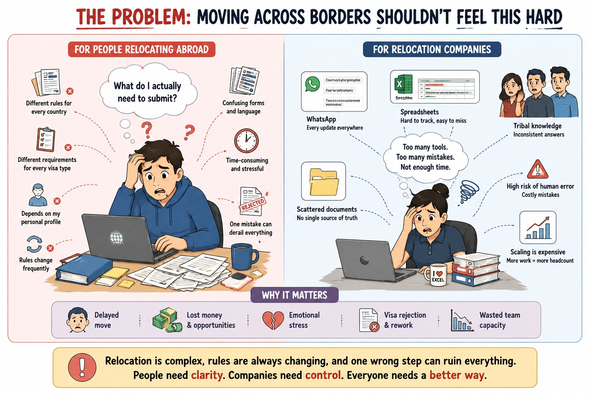
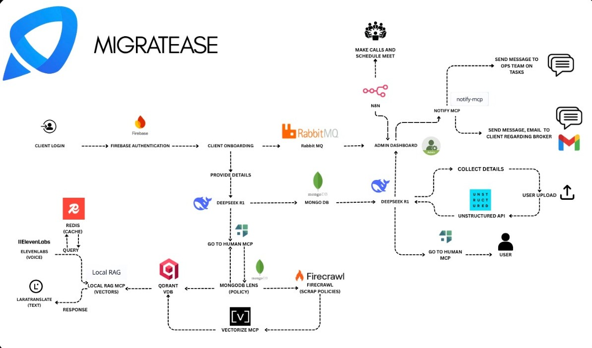
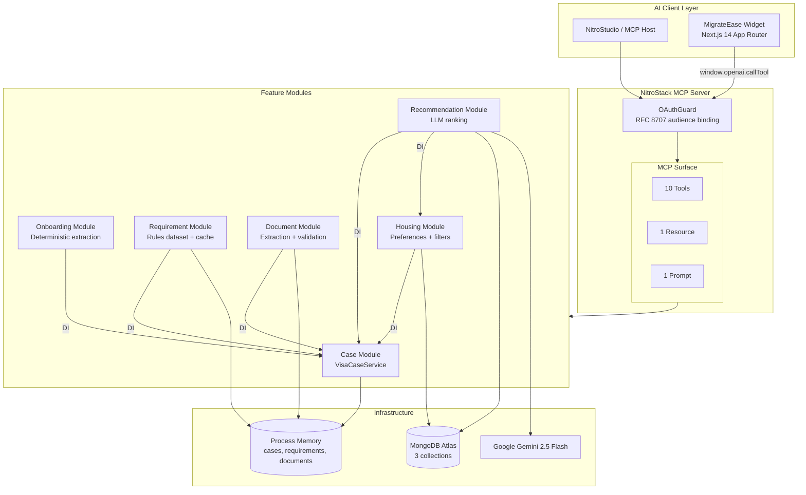
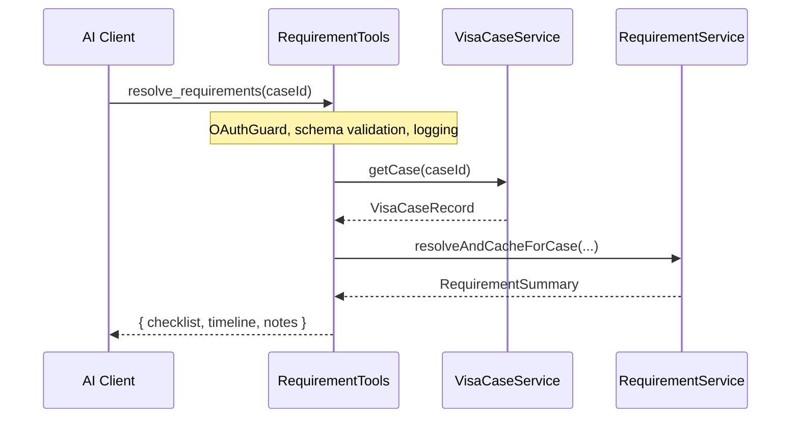
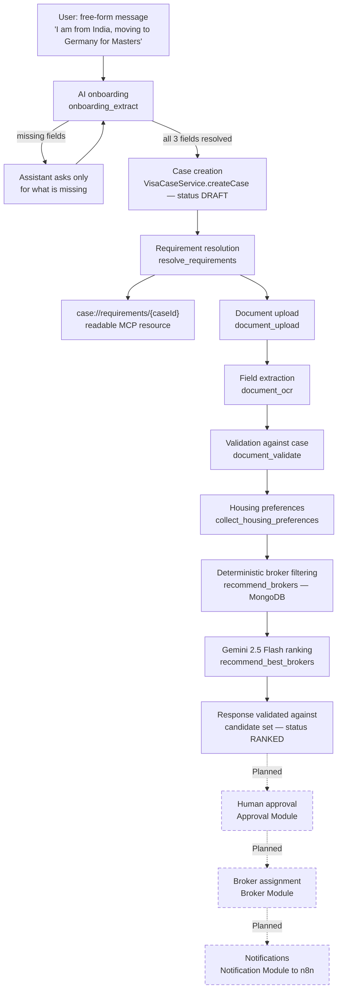
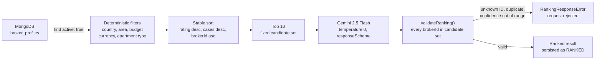

# MigrateEase

**An agentic AI operations platform for relocation and visa case management, built on the Model Context Protocol.**

> [HLD] NitroStack Platform Usage Map — implementation and target architecture
>
> MigrateEase uses the NitroStack SDK and CLI for its MCP server, decorators,
> dependency injection, OAuth request pipeline, dual transports, prompt, tool,
> resource, widget, and health-check surfaces. NitroStudio is the local
> development and MCP-inspection surface; the `migrate-ease` widget is the
> current client flow. The target deployment/chat surfaces are NitroCloud and a
> white-labelled NitroChat client.
>
> Target integrations are intentionally separated from the delivered slice:
> Firebase JWT client auth, Firecrawl/Fetch policy ingestion, Qdrant RAG,
> Redis caching, RabbitMQ worker fan-out, Unstructured/Document AI OCR,
> Lara translation, ElevenLabs voice, and n8n/Notify side effects. Their
> ownership and control flow are documented in module comments with explicit
> `IMPLEMENTED`, `STUB`, or `CONCEPTUAL` status so an evaluator can distinguish
> the technical plan from code that runs today.
>
> The important invariant is the 90/10 human-in-the-loop model: automation
> prepares onboarding, requirements, validation, and recommendations; a future
> OAuth-role-gated ops workflow alone accepts documents, assigns brokers, and
> submits applications, with an append-only audit record for every decision.
> [/HLD]

[](https://github.com/suganth07/visa-Agent)
[](https://www.typescriptlang.org/)
[](https://nitrostack.ai)
[](https://modelcontextprotocol.io)
[](https://www.mongodb.com/atlas)
[](https://ai.google.dev/)
[](https://nextjs.org/)
[](https://oauth.net/2.1/)

---

## Table of Contents

- [Problem Statement](#problem-statement)
- [Our Solution](#our-solution)
- [Why This Is Different](#why-this-is-different)
- [Key Features](#key-features)
- [Architecture](#architecture)
- [Complete Workflow](#complete-workflow)
- [Tech Stack](#tech-stack)
- [AI Components](#ai-components)
- [NitroStack](#nitrostack)
- [MongoDB Design](#mongodb-design)
- [Project Structure](#project-structure)
- [Installation](#installation)
- [Environment Variables](#environment-variables)
- [Running the Project](#running-the-project)
- [Demo Walkthrough](#demo-walkthrough)
- [Future Roadmap](#future-roadmap)
- [Challenges Faced](#challenges-faced)
- [Innovation](#innovation)
- [Why This Matters](#why-this-matters)
- [Screenshots](#screenshots)
- [License](#license)
- [Contributors](#contributors)

---

## Problem Statement

Cross-border relocation is one of the last large service industries still running on unstructured human memory.

A single relocation case — one employee moving from Bengaluru to Berlin, one student moving from Chennai to Toronto — touches an immigration consultant, an HR mobility coordinator, a document verification desk, a housing broker, a bank, and at least one consulate. Each handoff is a separate conversation, and almost none of them share a data model.

**Visa processing is difficult because the rules are a matrix, not a list.** Requirements are a function of at least four independent variables: applicant nationality, country of residence, destination jurisdiction, and purpose of travel. An Indian national applying for a German student visa faces a completely different evidence set, timeline, and consular procedure than the same applicant applying for a German work visa, and both differ again by which consulate jurisdiction the applicant falls under. Consulates revise these requirements without notice and without machine-readable publication. The correct answer for a case opened in March may be the wrong answer for an identical case opened in September.

**Traditional relocation companies struggle because the operating system is human.** In practice, the workflow looks like this:

| Operational reality | Consequence |
| --- | --- |
| Intake happens over **WhatsApp** and email threads | Case facts live in chat scrollback; nothing is queryable |
| Case tracking lives in **Excel** or a shared drive | No status model, no transition history, no audit trail |
| Requirements come from **tribal knowledge** — the one senior consultant who "knows the German cases" | Knowledge leaves when that person leaves; quality varies by who picks up the case |
| Document checking is **manual eyeballing** of PDF scans | Nationality mismatches and expired passports are caught late, often after a consular appointment is booked |
| Broker selection is a **phone call to a known contact** | No comparison, no rationale on record, no explanation to the client |
| Status updates are **pull-based** — the client asks, someone checks | Clients experience the process as a black box during the most stressful transition of their lives |

The compound effects are structural, not cosmetic:

- **No centralized intelligence.** Policy knowledge, case history, and document findings are fragmented across systems that do not talk to each other. Nothing accumulates.
- **No visibility.** Neither the applicant nor the operations lead can answer "what is blocking this case right now?" without a human going and looking.
- **No scalability.** Capacity scales linearly with headcount. Doubling case volume means doubling consultants, and the marginal consultant is less experienced than the last.
- **No accountability.** When an application is rejected for a preventable reason, there is no record of who decided what, on what evidence, and when.

The naive fix — "put a chatbot on it" — makes the problem worse. An LLM that confidently invents a document checklist for a jurisdiction it has stale training data on does not save a case; it costs someone a visa appointment and a semester.

---

## Our Solution

**MigrateEase is not another chatbot.** There is no free-form model deciding what a user needs. It is an **Agentic AI Operations Platform**: an MCP (Model Context Protocol) server that exposes relocation operations as governed, typed, individually auditable capabilities that an AI client can invoke — with deterministic logic owning every consequential decision and the model confined to the narrow tasks where language ability is genuinely the right tool.

The architecture is a deliberate inversion of the usual AI product. Instead of an LLM that occasionally calls a tool, MigrateEase is a **domain system that an LLM is permitted to drive**, one bounded step at a time, through a contract the server defines.

Concretely, the platform implements the following operational surface today:

**Client onboarding.** A free-form sentence — "I am from India and moving to Germany for Masters" — is parsed server-side into three structured fields (nationality, destination country, visa type) by a deterministic extractor. Complete input opens a case; incomplete input returns a precise list of what is missing, so the assistant asks one targeted question instead of restarting the conversation.

**Visa case management.** Every case is a first-class record with an ID, a status, a creation timestamp, and an explicit next step. Every downstream capability — requirements, documents, housing, broker ranking — reads that record rather than re-asking the applicant.

**Requirement generation.** Case attributes resolve against a jurisdiction rules dataset into a required-document checklist, an estimated timeline, an ordered list of application steps, and jurisdiction-specific caveats. The resolved summary is cached per case and readable back as an MCP resource.

**Document validation.** Documents are uploaded against a case, run through field extraction, and checked against the case record: does the passport nationality match the case, is the passport in date, does the admission letter name the destination on file, is the document type one the system recognizes. The result is a pass/fail breakdown with named checks — not an opaque score.

**Housing assistance.** Housing preferences (areas, apartment type, budget, currency, move-in date, family size, priorities, hard exclusions) are captured against the case and persisted to MongoDB Atlas, upserted by case ID so re-running intake corrects the record rather than duplicating it.

**Broker recommendation.** Broker eligibility is decided by deterministic MongoDB-backed filters. Broker *ordering* — and only ordering — is decided by Gemini 2.5 Flash, which receives a fixed candidate set and whose every returned broker ID is validated back against that set before the result is trusted.

**Human-in-the-loop approvals.** This is enforced today by *omission*, which is the strongest form of enforcement available before an approval module exists: there is no code path in this repository that assigns a broker, accepts a document as evidence, or submits an application. Recommendations persist with status `PENDING_RANKING` or `RANKED` — never `ASSIGNED`. A `VALID` document result is documented in the source as "passed local checks", explicitly not "accepted". The approval gate is a designed boundary, and see [Future Roadmap](#future-roadmap) for the module that will own it.

---

## Why This Is Different

| Dimension | Traditional relocation workflow | MigrateEase |
| --- | --- | --- |
| **Intake** | WhatsApp thread, 6–10 back-and-forth messages over 2 days | One sentence; structured extraction returns a case ID immediately, or names exactly which field is missing |
| **Time to requirement checklist** | Hours to days — depends on a consultant being free and knowing the jurisdiction | Sub-second, deterministic, from a rules dataset keyed on nationality + destination + visa type |
| **Automation** | None. Every step is a human action logged nowhere | 10 typed MCP tools, each independently invocable, schema-validated, and logged |
| **Transparency** | Client asks for status; someone checks a spreadsheet | Case record, requirement summary, and validation breakdown are all queryable; the requirement summary is exposed as a readable MCP resource |
| **AI assistance** | Ad-hoc use of consumer chatbots by individual staff, off the record | AI is scoped to two roles: conversational orchestration in the host client, and candidate ranking with schema-constrained, validated output |
| **Decision support** | "Use the broker we always use" | Deterministic eligibility filter over broker profiles, then a ranked shortlist with a per-broker written rationale and a confidence value |
| **Document checking** | Manual visual inspection; errors surface at the consulate | Field extraction plus four named deterministic checks against the case record, returned as `passedChecks` / `failedChecks` |
| **Operational scalability** | Linear in headcount; quality degrades with volume | Stateless tool surface; capacity constrained by infrastructure, not by which consultant is available |
| **Customer experience** | Black box; anxiety-driven follow-ups | Guided five-step widget flow — Describe, Case, Checklist, Upload, Verify — with progress state and a plain-language explanation at every stage |
| **Auditability** | Reconstructed after the fact from email | Structured logging with actor identity on every tool invocation; full audit module is designed and scoped (see roadmap) |

The distinction that matters most: **a chatbot answers questions about the process. MigrateEase executes the process** — and refuses to execute the parts a machine should not decide alone.

---

## Key Features

### Implemented

Every item below is live in this repository and callable today.

| # | Feature | Implementation | Source |
| --- | --- | --- | --- |
| 1 | **Conversational onboarding** | `onboarding_extract` parses nationality, destination, and visa type from free-form text and opens a case when all three resolve. Extraction is **deterministic regex/heuristics — no LLM call in this path**; the conversational layer is the host AI client, steered by the `onboarding_assistant` prompt | `modules/onboarding/` |
| 2 | **Visa case management** | `case_start` and `case_get`. Cases carry ID, destination, nationality, visa type, `DRAFT` status, creation timestamp, and next step. **In-memory store** — non-persistent by design in this slice | `modules/case/` |
| 3 | **Requirement generation** | `resolve_requirements` resolves a case into required documents, timeline, ordered application steps, and jurisdiction notes from a curated rules dataset. Covers India→Germany (Student, Work), India→USA (Student), India→Canada (Student) | `modules/requirement/` |
| 4 | **Requirement resource** | `case://requirements/{caseId}` — a read-only MCP resource returning the last generated summary for a case, with a clear "not generated yet" response rather than an error | `requirement.resources.ts` |
| 5 | **Document upload** | `document_upload` verifies the case exists via DI before storing base64 content and returning a document ID | `modules/document/` |
| 6 | **Field extraction (OCR stage)** | `document_ocr` decodes the payload and parses `Label: value` lines into typed field sets — passports yield full name, nationality, passport number, expiry; admission letters yield university, country, intake; anything else returns raw text. **A deterministic local parser, not a vendor OCR engine or a model** | `document.service.ts` |
| 7 | **Document validation** | `document_validate` runs four named checks against the case — recognized document type, case destination present, nationality match, passport not expired — and returns status, confidence (pass ratio, not a model score), and explicit pass/fail lists | `document.service.ts` |
| 8 | **Housing preference collection** | `collect_housing_preferences` upserts nine preference dimensions keyed on case ID | `modules/housing/` |
| 9 | **MongoDB Atlas integration** | Singleton `MongoService` adapter with a shared client, lazy connection, race-safe in-flight promise sharing, and a fixed enumerable collection registry | `services/mongodb.service.ts` |
| 10 | **Deterministic broker shortlisting** | `recommend_brokers` filters active brokers on country, area overlap, budget range with currency match, and apartment type; returns a stable-ordered top 10 and persists the shortlist | `housing.service.ts` |
| 11 | **AI broker recommendation** | `recommend_best_brokers` ranks the fixed shortlist with **Gemini 2.5 Flash** at `temperature: 0` under a declared response schema, then validates every returned broker ID, rank, confidence range, and duplicate against the candidate set before returning | `modules/recommendation/` |
| 12 | **NitroStack Widget UI** | A single Next.js 14 App Router widget (`migrate-ease`) implementing the full five-step flow. Every screen calls live backend tools through the widget SDK — **no mock data anywhere in the UI** | `src/widgets/` |
| 13 | **OAuth 2.1 scaffolding** | `OAuthModule` with RFC 8707 audience binding, RFC 7662 introspection support, JWKS verification, a reusable `OAuthGuard` applied to all 10 tools, and a scope-guard factory | `app.module.ts`, `guards/` |
| 14 | **Health checks** | `SystemHealthCheck` reporting uptime, heap usage, PID, and Node version on a 30-second interval | `health/system.health.ts` |

**Complete MCP surface: 10 tools, 1 resource, 1 prompt, 1 widget, 1 health check.**

### Planned

The following are specified in `docs/ARCHITECTURE.md` and are **not implemented**. They are listed here so the boundary between what runs and what is designed is unambiguous.

| Planned module | Responsibility per `docs/ARCHITECTURE.md` §6 |
| --- | --- |
| **Client Module** | Client-safe case views, information requests, consent capture, communication preferences |
| **Operations Module** | Operations queues, workload views, exception triage, controlled status changes |
| **Policy Knowledge Module** | Qdrant-backed policy retrieval with source attribution, freshness assessment, and jurisdiction filters, fed by a reviewed Firecrawl ingestion pipeline — replaces the current hardcoded requirement dataset |
| **Broker Module** | Broker profile lifecycle, approved assignments, minimum-necessary handoff packets, response tracking |
| **Task Module** | Actionable work items with due dates, ownership, dependencies, escalation, completion evidence |
| **Approval Module** | Approval requests, approver identity, decision rationale, expiry, immutable decision history — the enforcement point for broker assignment, document acceptance, and final submission |
| **Notification Module** | Notification intent, recipient authorization, template selection, n8n handoff for email and WhatsApp |
| **Audit and Observability Module** | Append-only audit records, correlation IDs, operational metrics, error classification |

Planned infrastructure named in the same document: **MongoDB as system of record for cases and documents**, **Qdrant**, **Firecrawl**, **Nitro Events**, **n8n**, and a vendor **OCR Service**.

---

## Architecture

MigrateEase is a modular, dependency-injected MCP server. The root module is composition-only; it imports feature modules and platform modules and contains no business logic.

### Target Architecture
<p align="center">
  
</p>
<p align="center">
  
</p>

<p align="center">
  <em>Overall MigrateEase System Architecture</em>
</p>

This is the architecture of record, reproduced from `docs/ARCHITECTURE.md` §4. Components in the lower rows are partially implemented — see the delivered slice diagram below.

```text
Client Portal / Operations Portal / MCP AI Client
                    |
                    v
          NitroStack MCP Server
     Tools | Resources | Prompts | Widgets
                    |
     +--------------+---------------+----------------+
     |              |               |                |
     v              v               v                v
Case and Task   Policy Knowledge  Document Intake  Identity and
Orchestration       Service        and OCR Service Authorization
     |              |               |                |
     v              v               v                v
MongoDB         Qdrant +          Document store   OAuth 2.1 and
cases, tasks,   Firecrawl policy  and extraction   role/scope guards
brokers, logs   updates           results
     |
     v
Nitro Events -> n8n -> Email and WhatsApp notifications
```

### Implemented Architecture



### Module Responsibilities

| Module | Owns | Depends on | Storage |
| --- | --- | --- | --- |
| **Case** | Case creation and retrieval; the authoritative case record. Exports `VisaCaseService` as the published contract every other module consumes | — | In-memory `Map` |
| **Onboarding** | Free-form message → structured fields; opens a case when complete, reports missing fields when not. Also owns the `onboarding_assistant` prompt | Case | Stateless |
| **Requirement** | Rules-dataset resolution of a case into checklist, timeline, steps, and notes; per-case summary cache backing the MCP resource | Case | In-memory cache |
| **Document** | Upload, deterministic field extraction, and validation of extracted fields against the case record | Case | In-memory `Map` |
| **Housing** | Housing preference capture and deterministic broker eligibility filtering; owns the ranking-payload builder consumed downstream | Case | MongoDB Atlas |
| **Recommendation** | LLM ordering of the Housing module's fixed candidate set, with strict validation and persistence of the ranked result | Case, Housing | MongoDB Atlas + Gemini |

### Why the System Is Modular

Each module owns exactly one business capability, its MCP contract, and its domain services. This is not organizational tidiness — it is what makes the platform replaceable in pieces. The Requirement Module's hardcoded dataset is scheduled for replacement by a Qdrant-backed Policy Knowledge Module. Because `RequirementService` exposes a stable `RequirementQuery → RequirementRule` shape, that swap changes one file and no caller. The same is true of the OCR stage: `DocumentService.runOcr()` returns a discriminated `OcrResult` union, so substituting a real extraction vendor behind it leaves `document_validate` and the entire tool surface untouched.

### Dependency Injection

Cross-module access uses NitroStack's DI container exclusively. `CaseModule` declares `exports: [VisaCaseService]`; the Onboarding, Requirement, Document, Housing, and Recommendation modules import `CaseModule` and receive the same service instance through constructor injection:

```typescript
@Injectable({ deps: [RecommendationService, VisaCaseService] })
export class RecommendationTools {
  constructor(
    private recommendationService: RecommendationService,
    private visaCaseService: VisaCaseService
  ) { }
}
```

The DI container is a process-wide singleton that caches instances by class token. This is load-bearing in the Recommendation Module, which lists `HousingService` and `MongoService` as providers directly — resolving to the *same* instances `HousingModule` uses, genuine reuse rather than a second copy. `HousingModule` is deliberately **not** imported there, because it is already imported by `AppModule` and importing it twice would register the housing tools a second time.

### Why Tools Never Call Tools

**No tool in this codebase invokes another tool.** This is enforced consistently across all six modules, and it is the single most important structural rule in the system.

A tool is a *contract with an AI client*: it validates input, enforces authorization, shapes a response, and logs an invocation. If tool A called tool B, then B's authorization check, logging, and response shaping would all execute inside A's request — producing double-counted audit entries, guards evaluated against the wrong caller context, and a call graph that is invisible to the host. It also couples two modules through their most volatile surface: the one designed for LLM consumption, which changes whenever the conversational ergonomics change.

Instead, **services communicate**. The pattern is uniform:



The tool is a thin orchestration layer over injected services. `RequirementTools` never calls `case_get`; it calls `VisaCaseService.getCase()`. `RecommendationService.loadShortlist()` composes three of `HousingService`'s public methods — `getPreferences`, `findEligibleBrokers`, `buildPreferenceSummary` — rather than re-querying MongoDB or reimplementing a single filter rule. The filtering logic exists in exactly one place, and the ranking layer physically cannot widen the candidate set it was given.

The payoff is auditability. Because eligibility is decided by deterministic code in one module and ordering by a model in another, you can replay the filter over historical data and verify precisely which brokers were eligible for a case, independently of whatever the model said about them.

---

## Complete Workflow



Solid nodes are implemented and callable today. Dashed nodes are designed in `docs/ARCHITECTURE.md` and not implemented — no code path in this repository assigns a broker or sends a notification.

### Step-by-Step

| Stage | Tool / capability | Deterministic or AI | Output |
| --- | --- | --- | --- |
| 1. Onboarding | `onboarding_extract` | Deterministic (regex/heuristics) | `case_started` + case ID, or `missing_information` + `missingFields[]` |
| 2. Case creation | `VisaCaseService.createCase` via DI | Deterministic | UUID case ID, `DRAFT` status, `createdAt`, `nextStep` |
| 3. Requirements | `resolve_requirements` | Deterministic (rules dataset) | `checklist[]`, `timeline`, `notes[]`; caches the full summary |
| 4. Upload | `document_upload` | Deterministic | `documentId`, `UPLOADED`, `uploadedAt` |
| 5. Extraction | `document_ocr` | Deterministic (label parser) | Typed `extractedFields` or raw `extractedText` |
| 6. Validation | `document_validate` | Deterministic (4 named checks) | `status`, `confidence`, `passedChecks[]`, `failedChecks[]` |
| 7. Housing intake | `collect_housing_preferences` | Deterministic | `preferenceId`, upserted to MongoDB |
| 8. Broker filtering | `recommend_brokers` | Deterministic (MongoDB + rules) | Up to 10 stable-ordered candidates, persisted as `PENDING_RANKING` |
| 9. Broker ranking | `recommend_best_brokers` | **AI** (Gemini 2.5 Flash) | `recommendedBroker`, `confidence`, `reason`, `topThree[]`, persisted as `RANKED` |
| 10. Approval | — | — | **Planned** |
| 11. Assignment | — | — | **Planned** |
| 12. Notifications | — | — | **Planned** |

---

## Tech Stack

### Backend

| Library | Version | Role |
| --- | --- | --- |
| `@nitrostack/core` | ^1.0.14 | MCP server framework — decorators, DI container, module system, OAuth module, health checks |
| `@nitrostack/cli` | ^1.0.15 | Development server, build pipeline, dependency installation |
| `@modelcontextprotocol/ext-apps` | >=0.1.0 | MCP Apps extension surface |
| `typescript` | ^5.3.3 | Strict mode, ES2022 target, experimental decorators, emit-decorator-metadata |
| `zod` | ^3.22.4 | Runtime input schema validation on every tool |
| `dotenv` | ^16.3.1 | Environment configuration loading |
| `axios` | ^1.7.9 | HTTP client (declared dependency) |
| `date-fns` | ^4.1.0 | Date utilities (declared dependency) |
| `@types/node` | ^22.10.0 | Node type definitions |

### Frontend

| Library | Version | Role |
| --- | --- | --- |
| `next` | ^14.2.5 | App Router, static export for production widget builds |
| `react` / `react-dom` | ^18.3.1 | Widget UI |
| `@nitrostack/widgets` | ^1.0.8 | Widget SDK — host bridge, `callTool`, `getToolOutput`, `waitForReady` |
| `typescript` | ^5 | Typed backend contracts mirrored in `lib/types.ts` |

The widget uses **zero UI dependencies** — no Tailwind, no component library. All 612 lines of the design system in `components/ui/index.tsx` are hand-written with CSS custom properties, which keeps the static export self-contained.

### AI

| Library | Version | Role |
| --- | --- | --- |
| `@google/genai` | ^2.13.0 | Google Gen AI SDK |
| Gemini 2.5 Flash | `gemini-2.5-flash` | Broker ranking with `responseSchema`, `responseMimeType: application/json`, `temperature: 0`, and a constraining `systemInstruction` |

### Database

| Library | Version | Role |
| --- | --- | --- |
| `mongodb` | ^7.5.0 | Official driver. MongoDB Atlas backs the three housing and broker collections |

### Infrastructure and Protocol

| Component | Role |
| --- | --- |
| **Model Context Protocol** | Transport and capability contract. STDIO in development, dual STDIO + HTTP in production |
| **OAuth 2.1** | RFC 9728 protected resource metadata, RFC 8707 audience binding, RFC 7662 token introspection, JWKS signature verification |
| **NitroStudio** | MCP host for interactive testing of tools, resources, prompts, and widgets |

---

## AI Components

MigrateEase runs a **hybrid pipeline**: deterministic code decides *what is true and what is allowed*; the language model decides only *how to order and explain* a set it was handed.

### Deterministic Extraction

Three separate extraction and validation stages contain no model call at all.

**Onboarding extraction** (`OnboardingExtractionService`) uses anchored regular expressions against a curated country list and a demonym map. It matches phrasings like `"I am from India"`, `"I'm Indian"`, and `"moving to Germany"`, then classifies visa type from prioritized keyword categories — Student, Work, Business, Family, Tourist. Critically, `normalizeCountryPhrase()` **returns `null` for unrecognized phrases rather than guessing**. A false negative asks the user one clarifying question; a false positive opens a case for the wrong jurisdiction.

**Document field extraction** (`DocumentService.runOcr`) decodes the payload and parses `Label: value` lines against ordered alias tables — `passport number` is checked before the looser `passport`. Absent labels yield `null`, never a synthesized value, so downstream validation reports "not found" honestly instead of validating against invented data. Invalid base64 or binary input degrades to an empty string rather than throwing.

**Document validation** (`DocumentService.validateAgainstCase`) runs four named checks and computes confidence as `passedChecks / totalChecks` — a plain ratio, explicitly documented in the source as not a model score. The same document and the same case always produce the same verdict.

### LLM Recommendation

Exactly one code path calls a model: `RecommendationService.rankCandidates()`.



### Why Hybrid Beats Fully-LLM

A fully-LLM system asked "which broker should this family use?" would have to hold every broker profile in its context, apply budget arithmetic and area matching in-weights, and produce an answer whose derivation cannot be inspected. Every one of those steps is a hallucination surface, and none of them benefits from language ability.

MigrateEase splits the problem at its natural seam:

| Concern | Owner | Why |
| --- | --- | --- |
| **Which brokers are eligible** | MongoDB query + TypeScript filters | Budget comparison, currency matching, and area intersection are arithmetic and set operations. Code does these exactly, reproducibly, and reviewably |
| **What order they should appear in** | Gemini 2.5 Flash | Weighing "covers two preferred areas but no Hindi support" against "one area, 142 prior cases, higher rating" is a genuine judgement call over unstructured attributes — the one thing a model does better than a scoring formula |
| **Whether the model's answer is usable** | `validateRanking()` | A schema constrains shape; only explicit set membership constrains content |

This yields four defences against hallucination, layered:

1. **The candidate set is fixed before the model sees it.** The prompt payload contains only brokers that already passed every filter. There is no way for the model to widen it.
2. **`temperature: 0` plus a declared `responseSchema`.** Output shape is constrained at the API level, not requested in prose.
3. **A constraining system instruction:** *"Rank ONLY the brokers provided. Never invent brokers. Never modify ratings. Never modify budgets. Never hallucinate."*
4. **Post-hoc set-membership validation.** `validateRanking()` rejects any response containing an unknown broker ID, a duplicate in `topThree`, a confidence outside 0–1, a non-integer rank, an empty rationale, or more entries than there were candidates. A model that invents an ID produces a `RankingResponseError` — never a silently-passed recommendation.

There is also a fifth, structural defence: when the deterministic filter returns zero candidates, `recommend_best_brokers` **returns early without calling the model at all**. An empty candidate set is the only circumstance under which a model could be tempted to invent a broker, so it is never given one.

The `prepareBrokerRankingPrompt()` builder lives in `HousingService`, not in the recommendation layer — the deterministic module remains the single definition of what a ranking stage is permitted to see, including the explicit constraint that applicant case details are never disclosed to brokers.

---

## NitroStack

NitroStack was chosen because relocation operations are a **governance problem wearing an AI costume**, and NitroStack is the only MCP framework in this class that treats governance as a first-class concern rather than middleware bolted on afterwards.

Three properties made it the right foundation:

1. **NestJS-style modules with real DI.** Vertical slices could be delivered independently — Case, then Onboarding, then Requirement, Document, Housing, Recommendation — each importing the previous one's *published service contract* rather than reaching into its internals. The `exports: [VisaCaseService]` boundary is enforced by the container, not by convention.
2. **Decorator-based MCP surface.** Tools, resources, prompts, widgets, guards, and health checks are all declarations on a class. The contract an AI client sees and the code that implements it cannot drift apart, because they are the same declaration.
3. **OAuth 2.1 as a module, not a tutorial.** Audience binding (RFC 8707), introspection (RFC 7662), JWKS verification, and protected resource metadata (RFC 9728) ship as configuration. For a platform that will eventually handle passport scans, that is the difference between a demo and a foundation.

### The Primitives, As Used Here

**Tools** — the write and action surface. Ten of them, each with a Zod `inputSchema`, a description written for an LLM to read, a declared request/response `example`, and `@UseGuards(OAuthGuard)`.

```typescript
@Tool({
  name: 'recommend_best_brokers',
  description: 'Ranks the deterministic broker shortlist for a case using Gemini 2.5 Flash... The candidate set comes from the Housing Module\'s deterministic filters and is never widened here — the model only orders the brokers it is given, and any response referencing an unknown broker is rejected. Advisory only: this does not assign a broker.',
  inputSchema: z.object({ caseId: z.string() }),
  examples: { /* ... */ }
})
@UseGuards(OAuthGuard)
async recommendBestBrokers(input: any, ctx: ExecutionContext) { /* ... */ }
```

The description doubles as a safety boundary: it tells the model what the tool will *not* do, so the assistant does not present a ranking as an assignment.

**Resources** — the read surface, addressed by URI. `case://requirements/{caseId}` returns the cached requirement summary with no computation and no side effects, which lets an assistant re-read a case's checklist without re-invoking the resolver.

**Prompts** — reusable, parameterized instruction templates. `onboarding_assistant` is the clearest expression of the platform's philosophy. It instructs the host AI client:

> *"Do not extract nationality, destination country, or visa type yourself, and do not guess them. Call the `onboarding_extract` tool with the user's message exactly as written, and rely only on its structured output."*

The prompt does not call an LLM. It **constrains** one — moving extraction out of the model's weights and into deterministic, testable server code.

**Widgets** — interactive UI surfaces mounted by a tool call. `@Widget('migrate-ease')` on `case_start`, `onboarding_extract`, `resolve_requirements`, and `document_validate` links the same widget to four entry points.

**MCP transport** — STDIO in development, dual STDIO + HTTP in production, with configurable session limits and idle timeouts to bound memory against unauthenticated initialize floods.

### Agent Architecture

The widget is not a form. It is an **app shell that seeds itself from whichever tool mounted it**:

```typescript
function seedFromToolOutput(output: unknown): FlowState | null {
  if (Array.isArray(o.passedChecks) && typeof o.status === 'string')
    return { screen: 'validation' };
  if (Array.isArray(o.checklist) && typeof o.caseId === 'string')
    return { screen: 'requirements', caseId: o.caseId };
  // ...
}
```

Each tool's output has a distinctive shape, so the widget infers the correct entry screen **without being told the tool name** — then drives every subsequent step through `callTool`. That is what lets a user complete Describe → Case → Checklist → Upload → Verify in one continuous surface instead of reopening a tool panel per step.

---

## MongoDB Design

Three collections are backed by MongoDB Atlas today, defined as a fixed registry in `services/mongodb.service.ts` so a typo cannot silently create a new collection at runtime:

```typescript
export const COLLECTIONS = {
  brokerProfiles: 'broker_profiles',
  housingPreferences: 'housing_preferences',
  brokerRecommendations: 'broker_recommendations'
} as const;
```

### Storage Reality

| Collection / store | Backend today | Owner |
| --- | --- | --- |
| `broker_profiles` | **MongoDB Atlas** (read-only) | `HousingService` |
| `housing_preferences` | **MongoDB Atlas** | `HousingService` |
| `broker_recommendations` | **MongoDB Atlas** | `HousingService`, `RecommendationService` |
| `cases` | **In-memory `Map`** — non-persistent, lost on restart | `VisaCaseService` |
| `documents` | **In-memory `Map`** — non-persistent, lost on restart | `DocumentService` |
| requirement summaries | **In-memory cache** — non-persistent | `RequirementService` |

Migrating `cases` and `documents` to MongoDB is Phase 1 / Phase 3 roadmap work. The schemas below are the shipped TypeScript record shapes.

### `broker_profiles`

Read-only in this slice; profile lifecycle belongs to the planned Broker Module.

```typescript
{
  brokerId: string;              // stable identifier; the ranking validation key
  name: string;
  description: string;
  rating: number;
  country: string;               // matched against case destinationCountry
  city?: string;                 // folded into the area-overlap check
  areasCovered: string[];
  apartmentTypes: string[];
  minBudget?: number;            // absent = open-ended lower bound
  maxBudget?: number;            // absent = open-ended upper bound
  currency: string;              // mismatch is always disqualifying
  languages: string[];
  previousCasesHandled: number;
  active: boolean;               // pushed into the Mongo query
}
```

### `housing_preferences`

Upserted on `caseId`, so re-running intake corrects the record rather than accumulating duplicates a later read would have to disambiguate.

```typescript
{
  preferenceId: string;          // stable across upserts
  caseId: string;                // upsert key
  preferredAreas: string[];
  apartmentType: string;
  monthlyBudget: number;
  currency: string;
  moveInBy: string;              // ISO 8601
  familySize: number;
  priorities: string[];
  hardExclusions: string[];
  description: string;
  createdAt: string;             // preserved across upserts
  updatedAt: string;
}
```

### `broker_recommendations`

Holds two distinct document shapes, deliberately never merged. `HousingService.saveRecommendation()` writes the unranked shortlist; `RecommendationService.saveRankedRecommendation()` inserts a separate record — it does not update the first, because a ranked recommendation is a different artifact and must not overwrite or impersonate the deterministic shortlist that produced it.

```typescript
// Written by recommend_brokers — the deterministic shortlist
{
  recommendationId: string;
  caseId: string;
  requirements: HousingPreferenceSummary;
  candidates: BrokerCandidate[];
  candidateCount: number;
  status: 'PENDING_RANKING';
  createdAt: string;
}

// Written by recommend_best_brokers — the AI ranking
{
  recommendationId: string;
  caseId: string;
  requirements: HousingPreferenceSummary;
  candidates: BrokerCandidate[];   // the exact set the model was shown
  candidateCount: number;
  recommendedBroker: string;
  confidence: number;              // 0-1, validated
  reason: string;
  topThree: { brokerId: string; rank: number; reason: string }[];
  model: 'gemini-2.5-flash';       // recorded for traceability
  status: 'RANKED';                // never 'ASSIGNED'
  createdAt: string;
}
```

### Planned Shapes (currently in-memory)

```typescript
// cases — VisaCaseService
{ caseId, destinationCountry, nationality, visaType,
  status: 'DRAFT', createdAt, nextStep }

// documents — DocumentService
{ documentId, caseId, documentType, filename, uploadTime,
  status: 'UPLOADED' | 'OCR_COMPLETE' | 'VALIDATED' | 'INVALID',
  rawContentBase64, ocr? }
```

### Why Collections Are Separated

**Different lifecycles.** Broker profiles change when a broker updates their business. Preferences change when an applicant reconsiders. Recommendations are point-in-time artifacts that must never change at all. Embedding any of these in another would force the immutable to inherit the mutable's write pattern.

**Different ownership and authorization.** `broker_profiles` will be written by the planned Broker Module and is read-only everywhere else. Separate collections make "housing may read broker profiles but never write them" expressible as a permission rather than a code review convention.

**Immutable decision records.** A recommendation stores the candidate set *as it was at ranking time*, alongside the model name. If a broker's rating changes tomorrow, the record of what the system was shown yesterday must not change with it. That is only possible if the recommendation is a self-contained document rather than a set of references.

**Independent query patterns.** Broker filtering scans profiles by `active` and `country`. Preference reads are point lookups by `caseId`. Recommendation reads are audit-shaped — history for one case. These want different indexes.

Explicit gap, documented in the source: **no indexes are created by this slice.** `{ caseId }` on preferences and recommendations, and `{ active, country }` on profiles, are required before production use. Tenant boundaries and retention rules are equally unimplemented and equally required.

---

## Project Structure

```
visa-Agent/
├── docs/                                  # Architectural source of truth
│   ├── ARCHITECTURE.md                    # Modules, services, boundaries, roadmap
│   ├── EVENTS.md                          # Canonical Nitro Event contracts (planned)
│   ├── MODULES.md                         # Per-module responsibilities
│   ├── PROMPTS.md                         # Prompt families and safety rules
│   ├── RESOURCES.md                       # Resource URI families
│   ├── TASKS.md                           # Task and lifecycle flows
│   ├── TOOLS.md                           # Tool design guidelines
│   └── WIDGETS.md                         # Widget design guidelines
│
├── src/
│   ├── index.ts                           # Bootstrap — McpApplicationFactory
│   ├── app.module.ts                      # Root module: OAuth + 6 feature modules
│   │
│   ├── guards/
│   │   └── oauth.guard.ts                 # OAuthGuard + createScopeGuard factory
│   │
│   ├── health/
│   │   └── system.health.ts               # Uptime and heap health check
│   │
│   ├── services/
│   │   └── mongodb.service.ts             # MongoDB Atlas adapter + COLLECTIONS registry
│   │
│   ├── modules/
│   │   ├── case/                          # Slice 1 — the authoritative case record
│   │   │   ├── case.module.ts             #   exports: [VisaCaseService]
│   │   │   ├── case.service.ts
│   │   │   └── case.tools.ts              #   case_start, case_get
│   │   │
│   │   ├── onboarding/                    # Slice 2 — deterministic NL extraction
│   │   │   ├── onboarding.module.ts
│   │   │   ├── onboarding-extraction.service.ts
│   │   │   ├── onboarding.service.ts
│   │   │   ├── onboarding.prompts.ts      #   onboarding_assistant
│   │   │   └── onboarding.tools.ts        #   onboarding_extract
│   │   │
│   │   ├── requirement/                   # Slice 3 — rules dataset + cache
│   │   │   ├── requirement.module.ts
│   │   │   ├── requirement.service.ts
│   │   │   ├── requirement.resources.ts   #   case://requirements/{caseId}
│   │   │   └── requirement.tools.ts       #   resolve_requirements
│   │   │
│   │   ├── document/                      # Slice 4 — upload, extraction, validation
│   │   │   ├── document.module.ts
│   │   │   ├── document.service.ts
│   │   │   └── document.tools.ts          #   document_upload, _ocr, _validate
│   │   │
│   │   ├── housing/                       # Slice 5 — first MongoDB-backed module
│   │   │   ├── housing.module.ts
│   │   │   ├── housing.service.ts
│   │   │   └── housing.tools.ts           #   collect_housing_preferences,
│   │   │                                  #   recommend_brokers
│   │   └── recommendation/                # Slice 6 — Gemini ranking layer
│   │       ├── recommendation.module.ts
│   │       ├── recommendation.service.ts
│   │       └── recommendation.tools.ts    #   recommend_best_brokers
│   │
│   └── widgets/                           # Next.js 14 widget application
│       ├── app/
│       │   ├── layout.tsx
│       │   ├── globals.css
│       │   └── migrate-ease/page.tsx      #   App shell + tool-output seeding
│       ├── components/
│       │   ├── screens/
│       │   │   ├── Landing.tsx            #   Entry
│       │   │   ├── Chat.tsx               #   Screen 2 — onboarding_extract
│       │   │   ├── CaseSummary.tsx        #   Screen 3 — case_get
│       │   │   ├── Checklist.tsx          #   Screen 4 — resolve_requirements
│       │   │   ├── Upload.tsx             #   Screen 5 — document_upload
│       │   │   └── Validation.tsx         #   Screen 6 — document_ocr + _validate
│       │   └── ui/index.tsx               #   Hand-written design system
│       ├── lib/
│       │   ├── mcp.ts                     #   callTool + multi-layer host unwrapping
│       │   ├── types.ts                   #   Backend contracts mirrored exactly
│       │   └── format.ts                  #   base64, dates, label humanization
│       ├── widget-manifest.json
│       ├── next.config.js
│       └── package.json
│
├── .env.example                           # Fully annotated configuration reference
├── OAUTH_SETUP.md                         # OAuth 2.1 provider setup guide
├── Progress.md                            # Delivery phase tracker
├── package.json
└── tsconfig.json
```

---

## Installation

### Prerequisites

| Requirement | Notes |
| --- | --- |
| Node.js 20+ | ES2022 target, `node:crypto` imports |
| npm | Ships with Node |
| MongoDB Atlas cluster | Required only for the housing and recommendation tools |
| Google AI Studio API key | Required only for `recommend_best_brokers` — [aistudio.google.com/apikey](https://aistudio.google.com/apikey) |
| NitroStudio | MCP host for testing — [nitrostack.ai/studio](https://nitrostack.ai/studio) |

### 1. Clone

```bash
git clone https://github.com/suganth07/visa-Agent.git
cd visa-Agent
```

### 2. Install

```bash
npm install                          # backend
npm --prefix src/widgets install     # widget application
```

### 3. Configure

```bash
cp .env.example .env
```

### 4. MongoDB Atlas

Create a cluster, add a database user, allow-list your IP, and copy the connection string into `.env`:

```bash
MONGODB_URI=mongodb+srv://<user>:<password>@<cluster>.mongodb.net/?retryWrites=true&w=majority
DB_NAME=visa_agent
```

Seed `broker_profiles` with at least one document matching the schema in [MongoDB Design](#mongodb-design). The housing filters are strict — country, area, currency, budget range, and apartment type must all match for a broker to be shortlisted.

### 5. Gemini

```bash
GEMINI_API_KEY=your-google-ai-studio-api-key
```

### 6. Run

```bash
npm run dev
```

### 7. NitroStudio

Download NitroStudio, connect it to the running server, and the tools, resource, prompt, and widget appear automatically.

**Graceful degradation is by design.** The server boots and all other tools work without `MONGODB_URI` or `GEMINI_API_KEY`. Both dependencies are constructed lazily, and the failure surfaces on first use of the specific tool that needs them, with an actionable message naming the missing variable.

---

## Environment Variables

### NitroStack

| Variable | Required | Default | Description |
| --- | --- | --- | --- |
| `NITRO_LOG_LEVEL` | No | `info` | Server log verbosity |
| `NITROSTACK_APP_MODE` | No | `openai` | Application integration mode |

### Transport

| Variable | Required | Default | Description |
| --- | --- | --- | --- |
| `MCP_TRANSPORT_TYPE` | No | `stdio` in dev, `dual` in production | `stdio`, `http`, or `dual` |
| `PORT` | No | `3000` | HTTP transport port |
| `HOST` | No | `localhost` | HTTP bind address |
| `ENABLE_CORS` | No | — | Enable CORS on HTTP transport |
| `MCP_MAX_SESSIONS` | No | `1000` | Session cap; bounds memory against unauthenticated initialize floods |
| `MCP_SESSION_TIMEOUT_MS` | No | `1800000` | Idle session timeout (30 minutes) |

### OAuth 2.1

| Variable | Required | Default | Description |
| --- | --- | --- | --- |
| `OAUTH_REQUIRED` | No | `false` | Enforcement gate. `false` leaves protected endpoints reachable without a token (local development). `true` is fail-closed |
| `RESOURCE_URI` | Yes | `https://mcplocal` | This server's public identifier. Must match the audience of issued tokens (RFC 8707) |
| `AUTH_SERVER_URL` | Yes | — | Authorization server / tenant domain |
| `TOKEN_AUDIENCE` | No | falls back to `RESOURCE_URI` | Expected `aud` claim |
| `TOKEN_ISSUER` | No | — | Expected `iss` claim |
| `JWKS_URI` | No | — | JWKS endpoint for cryptographic signature verification. **Recommended** |
| `INTROSPECTION_ENDPOINT` | No | — | RFC 7662 endpoint, for opaque (non-JWT) tokens |
| `INTROSPECTION_CLIENT_ID` | No | — | Introspection client credential |
| `INTROSPECTION_CLIENT_SECRET` | No | — | Introspection client secret |
| `OAUTH_DISCOVERY_PORT` | No | `3005` | Discovery metadata endpoint port |
| `OAUTH_DISCOVERY_AUTO_RETRY` | No | — | Retry discovery endpoint binding |
| `OAUTH_ENABLE_CLIENT_REGISTRATION` | No | `false` | Expose `/oauth/v2/register`; serves only the statically configured client |
| `OAUTH_CLIENT_ID` | No | — | Static client ID; without it, registration stays disabled |
| `OAUTH_CLIENT_SECRET` | No | — | Static client secret |

Token validation is **secure by default**: if neither `JWKS_URI` nor `INTROSPECTION_ENDPOINT` is configured, all tokens are rejected. Unsigned token decoding is disabled and available only via the in-code `allowInsecureTokenDecode` option, intended for local development.

### MongoDB Atlas

| Variable | Required | Description |
| --- | --- | --- |
| `MONGODB_URI` | For housing/recommendation tools | Atlas connection string. Read at connect time, not import time, so the server boots without it |
| `DB_NAME` | For housing/recommendation tools | Database name, e.g. `visa_agent` |

### Google Gemini

| Variable | Required | Description |
| --- | --- | --- |
| `GEMINI_API_KEY` | For `recommend_best_brokers` | Google AI Studio key. Client is constructed lazily; only this one tool fails without it |

---

## Running the Project

### Backend

```bash
npm run dev          # nitrostack-cli dev — STDIO transport, hot reload
npm run build        # compile TypeScript to dist/
npm start            # build, then start
npm run start:prod   # start without rebuilding
npm run upgrade      # upgrade NitroStack dependencies
npm run install:all  # nitrostack-cli install
```

### Frontend

```bash
npm --prefix src/widgets run dev     # http://localhost:3001
npm --prefix src/widgets run build   # static export to src/widgets/out/
npm --prefix src/widgets run start   # serve the production build
```

Opening `localhost:3001` directly renders the widget with an explicit warning banner: *"Not connected to the MigrateEase server."* This is intentional. The widget's only transport is `window.openai.callTool`, injected by the MCP host — there is no fallback and no mock data. The banner tells the user exactly why nothing loads and what to do about it.

### NitroStudio

1. Start the backend with `npm run dev`.
2. Open NitroStudio and connect to the running server.
3. Tools, the `case://requirements/{caseId}` resource, the `onboarding_assistant` prompt, and the `migrate-ease` widget register automatically.
4. For OAuth, use Studio's **Auth → OAuth 2.1** tab. With `OAUTH_REQUIRED` unset, tools are callable without a token; a valid token, if supplied, still attaches identity to the execution context.

---

## Demo Walkthrough

Two paths, both against the same live backend.

### Path A — Widget Flow (recommended for judges)

Invoke `onboarding_extract` from NitroStudio with a complete message. The `migrate-ease` widget mounts, detects the tool output shape, and lands on the Case screen.

| Step | Screen | Action | Backend call |
| --- | --- | --- | --- |
| 1 | **Describe** | Type "I am from India and moving to Germany for Masters" | `onboarding_extract` |
| 2 | **Case** | Review case ID, destination, nationality, visa type, `DRAFT` status | `case_get` |
| 3 | **Checklist** | Tick off the eight required documents; read the timeline and jurisdiction notes | `resolve_requirements` |
| 4 | **Upload** | Paste passport text (or attach a file); choose document type | `document_upload` |
| 5 | **Verify** | Watch the two-phase Reading → Checking progression, then the check breakdown | `document_ocr`, then `document_validate` |

The stepper enforces reachability: Case, Checklist, and Upload require a case ID; Verify requires a document ID. There is no way to reach a screen whose data does not exist.

### Path B — Direct Tool Invocation

#### 1. `onboarding_extract`

```json
{ "message": "I am from India and moving to Germany for Masters" }
```

```json
{
  "outcome": "case_started",
  "extracted": { "nationality": "India", "destinationCountry": "Germany", "visaType": "Student" },
  "caseId": "3fa85f64-5717-4562-b3fc-2c963f66afa6",
  "status": "DRAFT",
  "nextStep": "Complete onboarding."
}
```

Try an incomplete message — `"I want to study abroad"` — to see the deterministic extractor refuse to guess:

```json
{
  "outcome": "missing_information",
  "extracted": { "nationality": null, "destinationCountry": null, "visaType": "Student" },
  "missingFields": ["nationality", "destinationCountry"],
  "message": "Missing required information: nationality, destinationCountry"
}
```

#### 2. `case_start` (direct case creation)

```json
{ "destinationCountry": "France", "nationality": "United States", "visaType": "tourist" }
```

Returns `caseId`, `status: "DRAFT"`, `createdAt`, `nextStep`.

#### 3. `case_get`

```json
{ "caseId": "<caseId>" }
```

Returns the full case record.

#### 4. `resolve_requirements`

```json
{ "caseId": "<caseId from step 1>" }
```

```json
{
  "caseId": "3fa85f64-5717-4562-b3fc-2c963f66afa6",
  "checklist": [
    "Valid passport",
    "University admission/enrollment letter",
    "Proof of financial resources (e.g., blocked account)",
    "Health insurance",
    "Academic transcripts and certificates",
    "Letter of motivation",
    "Completed visa application form",
    "Biometric photos"
  ],
  "timeline": "6-12 weeks for appointment scheduling and processing",
  "notes": [
    "Requirements vary by German consulate jurisdiction and can change without notice.",
    "This is illustrative sample data, not verified embassy guidance."
  ]
}
```

Covered combinations: India→Germany (Student, Work), India→USA (Student), India→Canada (Student). Anything else raises an explicit error naming the unsupported combination — the system does not fabricate a checklist.

#### 5. Read the resource

```
case://requirements/3fa85f64-5717-4562-b3fc-2c963f66afa6
```

Returns the full cached summary including `applicationSteps` and `generatedAt`. Read it *before* step 4 to see the honest `available: false` response.

#### 6. `document_upload`

Base64-encode a passport in `Label: value` form:

```
Full Name: ANJALI SHARMA
Nationality: India
Passport Number: Z1234567
Date of Expiry: 2030-04-18
```

```json
{
  "caseId": "<caseId>",
  "documentType": "passport",
  "fileName": "passport.txt",
  "contentBase64": "<base64>"
}
```

Returns `documentId`, `status: "UPLOADED"`, `uploadedAt`.

#### 7. `document_ocr`

```json
{ "documentId": "<documentId>" }
```

```json
{
  "documentId": "9c1f0e2a-77b4-4c3d-9a51-1f7e2b6d8c40",
  "documentType": "passport",
  "kind": "passport",
  "extractedAt": "2026-07-26T12:00:00.000Z",
  "extractedFields": {
    "fullName": "ANJALI SHARMA",
    "nationality": "India",
    "passportNumber": "Z1234567",
    "expiryDate": "2030-04-18"
  }
}
```

#### 8. `document_validate`

```json
{ "caseId": "<caseId>", "documentId": "<documentId>" }
```

```json
{
  "status": "VALID",
  "confidence": 1,
  "passedChecks": [
    "required_document_type_recognized",
    "case_destination_present",
    "nationality_matches_case",
    "passport_not_expired"
  ],
  "failedChecks": [],
  "extractedFields": { "fullName": "ANJALI SHARMA", "nationality": "India", "passportNumber": "Z1234567", "expiryDate": "2030-04-18" }
}
```

**Test the failure path.** Upload a second passport with `Nationality: Pakistan` and an expiry of `2020-01-01` against the same India→Germany case:

```json
{
  "status": "INVALID",
  "confidence": 0.5,
  "passedChecks": ["required_document_type_recognized", "case_destination_present"],
  "failedChecks": ["nationality_matches_case", "passport_not_expired"]
}
```

Every failure is named. Nothing is hidden behind a score.

#### 9. `collect_housing_preferences` *(requires MongoDB)*

```json
{
  "caseId": "<caseId>",
  "preferredAreas": ["Mitte", "Kreuzberg"],
  "apartmentType": "2bhk",
  "monthlyBudget": 2200,
  "currency": "EUR",
  "moveInBy": "2026-09-01",
  "familySize": 2,
  "priorities": ["commute", "school_access"],
  "hardExclusions": ["No basement apartments"],
  "description": "Family of two relocating for a Masters programme."
}
```

Returns `success: true`, `preferenceId`, `updatedAt`. Re-run it with a different budget — the `preferenceId` and `createdAt` stay the same, only `updatedAt` moves.

#### 10. `recommend_brokers` *(requires MongoDB)*

```json
{ "caseId": "<caseId>" }
```

Returns `recommendationId`, `candidateCount`, the preference summary, and up to 10 deterministically matched brokers ordered by rating, then prior case volume, then broker ID. **No LLM is involved.** Run it twice — the order is byte-identical.

#### 11. `recommend_best_brokers` *(requires MongoDB + Gemini)*

```json
{ "caseId": "<caseId>" }
```

```json
{
  "caseId": "3fa85f64-5717-4562-b3fc-2c963f66afa6",
  "recommendationId": "b7c2e1d0-4f8a-4c11-9d33-5a1e2f7b9c04",
  "candidateCount": 2,
  "recommendedBroker": "broker_berlin_001",
  "confidence": 0.94,
  "reason": "Covers Mitte and Kreuzberg, handles 2bhk apartments within the stated budget, and lists Hindi language support for a family of two.",
  "topThree": [
    { "brokerId": "broker_berlin_001", "rank": 1, "reason": "Strongest area coverage and the highest prior case volume of the candidates." },
    { "brokerId": "broker_berlin_002", "rank": 2, "reason": "Covers two preferred areas but does not list Hindi language support." }
  ]
}
```

**Test the guardrail.** Set `monthlyBudget` to a value no broker supports and re-run. The deterministic filter returns zero candidates, and the tool short-circuits **without calling Gemini at all**:

```json
{
  "caseId": "<caseId>",
  "candidateCount": 0,
  "recommendedBroker": null,
  "confidence": 0,
  "reason": "No brokers matched this case's destination, preferred areas, budget, and apartment type. Nothing was ranked.",
  "topThree": []
}
```

Note what is absent from every response above: no `assignedBroker`, no `submitted`, no `approved`. Those states require human authority the platform does not claim.

---

## Future Roadmap

Scoped exclusively to modules and phases specified in `docs/ARCHITECTURE.md`.

### Implemented Today

| Capability | Status |
| --- | --- |
| Case Module (creation, retrieval) | Implemented — in-memory |
| Onboarding (deterministic extraction, prompt) | Implemented |
| Requirement resolution (rules dataset, resource) | Implemented — placeholder for Policy Knowledge Module |
| Document Module (upload, extraction, validation) | Implemented — in-memory, local parser |
| Housing (preferences, deterministic filtering) | Implemented — MongoDB Atlas |
| Broker Recommendation (Gemini ranking + validation) | Implemented — MongoDB Atlas |
| OAuth 2.1 module and guard | Implemented — enforcement gate off by default |
| NitroStack Widget UI (5-step flow) | Implemented |
| System health check | Implemented |

### Future Work

| Phase | Scope per `docs/ARCHITECTURE.md` §19 |
| --- | --- |
| **Phase 1: Platform Foundation** | MongoDB collections, indexes, tenant boundaries, audit-log retention; scope, role, and tenant guards; canonical case/document/task/approval/event contracts; correlation IDs and error taxonomy |
| **Phase 2: Case and Portal Foundation** | **Client Module**, **Operations Module**, **Task Module**; client-safe status and operations work-queue read models; Client and Operations Portal widgets; case lifecycle transition policy |
| **Phase 3: Document Intelligence and Human Review** | Secure intake, malware-scanning policy, vendor OCR integration; extraction review and evidence-request workflows; **human approval required before any document is accepted** |
| **Phase 4: Policy Knowledge and Retrieval** | **Policy Knowledge Module** — Firecrawl ingestion, provenance, freshness, jurisdiction tagging, Qdrant indexing; cited prompt families; controls for stale or conflicting sources |
| **Phase 5: Broker and Approval Governance** | **Broker Module** — profiles, minimum-necessary handoff packages, assignment tracking. **Approval Module** across broker assignment, document acceptance, and final submission; approval queues, delegated authority, immutable audit views |
| **Phase 6: Notifications and Workflow Automation** | **Notification Module** — versioned Nitro Event contracts, idempotent handlers, n8n integration, consent-aware email and WhatsApp delivery, escalation rules |
| **Phase 7: Controlled Submission Capability** | Submission-readiness validation and snapshot; **explicit final human approval before any external submission**; submission adapters and recovery workflows |
| **Phase 8: Enterprise Hardening** | Contract, authorization, integration, event-replay, and resilience testing; SLOs, incident runbooks, retention automation, privacy request workflows, tenant administration |

The full case lifecycle — Draft → Intake in Progress → Evidence Collection → Operations Review → Broker Assignment Pending Approval → Broker Assigned → Submission Readiness Review → Final Submission Pending Approval → Submitted → Decision Received → Closed, plus On Hold, Information Required, Escalated, Withdrawn, and Rejected — is specified in `docs/ARCHITECTURE.md` §14. Only `DRAFT` is implemented.

---

## Challenges Faced

### 1. Visa rules are a matrix, not a lookup table

**Problem.** Requirements vary across nationality × destination × visa type × consular jurisdiction, and change without machine-readable notice. Naive normalization produces catastrophic false matches: `"USA"`, `"U.S.A."`, `"United States of America"`, and `"us"` must collapse to one key, but a phrase that merely looks like a country must not become one.

**Solution.** A composite key with explicit alias maps and normalizers, and a **failure-closed** lookup. `RequirementService.resolveRequirements()` throws a message naming the exact unsupported combination rather than degrading to a generic checklist. The `notes` array on every rule carries the disclaimer *"This is illustrative sample data, not verified embassy guidance"* — the honesty is in the data, so it cannot be lost in presentation.

**Where the seam is.** The service's `RequirementQuery → RequirementRule` shape is designed so the Qdrant-backed Policy Knowledge Module drops in behind it without changing a single caller.

### 2. Document verification without a vendor OCR

**Problem.** Real OCR means an external service, per-page cost, network latency, and a per-field confidence model. A hackathon slice cannot ship that, but an extraction layer that *pretends* to work — returning plausible values it never actually read — is worse than none.

**Solution.** A deterministic `Label: value` parser with ordered alias tables, and one absolute rule: **fields are never synthesized.** An absent label yields `null`, so validation reports "not found" honestly. Invalid base64 or binary input degrades to an empty string instead of throwing. `document_validate` returns four *named* checks, and confidence is `passed / total` — the source comments state explicitly that this is a ratio and not a model score. `OcrResult` is a discriminated union, so a vendor swap changes one method body.

**Boundary held.** A `VALID` result is documented throughout the module as "passed local checks", explicitly not "accepted as evidence" — acceptance is an Operations decision the code refuses to simulate.

### 3. LLM hallucination prevention

**Problem.** A model asked to recommend a broker will invent a plausible one. In relocation, that means a client sent to a company that does not exist.

**Solution.** Five layered defences, described in full in [AI Components](#ai-components): a candidate set fixed *before* the model sees it; `temperature: 0` with a declared `responseSchema`; a constraining system instruction; post-hoc set-membership validation (`validateRanking()` rejects unknown IDs, duplicates, out-of-range confidence, non-integer ranks, empty rationales, and over-length lists); and an early return that skips the model entirely when there is nothing to rank.

The structural insight: **a schema constrains shape but not content.** Only explicit set membership constrains content. Both are needed.

### 4. MCP architecture — the tools-never-call-tools discipline

**Problem.** `resolve_requirements` needs a case. `document_validate` needs a case. `recommend_best_brokers` needs a case *and* a housing shortlist. The obvious implementation — call `case_get` — corrupts authorization context, double-counts audit entries, and couples modules through their most volatile surface.

**Solution.** Strict layer separation. Tools own the AI contract: schema validation, guards, logging, response shaping. Services own domain logic. Cross-module access is DI only — `CaseModule` exports `VisaCaseService`; five modules import it. `RecommendationService.loadShortlist()` composes `HousingService`'s public methods rather than re-querying MongoDB.

**The hardest case.** `BrokerRecommendationModule` needs `HousingService` but must not import `HousingModule` — that would register the housing tools a second time. The resolution relies on the DI container being a process-wide singleton keyed by class token: listing `HousingService` and `MongoService` as providers resolves to the *same* instances `HousingModule` uses. This is documented at length in the module's header comment, because it is non-obvious and would otherwise look like a duplicate registration bug.

### 5. MongoDB integration without breaking startup

**Problem.** The server must boot and serve every other tool when MongoDB is unconfigured — a judge without an Atlas cluster should still see most capabilities work. But reading configuration at import time makes an unset variable a fatal startup error.

**Solution.** Configuration is read at **connect time**, not import time. A single `MongoClient` is held in static fields so the DI container constructing the provider twice still yields one client and one in-flight connection promise, and concurrent first callers share that promise instead of racing to open multiple clients. A failed connection clears the cached promise so a later call can retry rather than inheriting a permanently poisoned state. Collection names live in a frozen `COLLECTIONS` registry, so a typo cannot silently create a new collection at runtime.

The same lazy-construction contract governs the Gemini client. Both failures surface on first use of the specific tool, with a message naming the missing variable and pointing at `.env.example`.

### 6. Widget–host communication

**Problem.** MCP hosts disagree on how deeply they wrap a tool result. Some return the flat payload. Some return `{ result, structuredContent }`. Some forward the entire JSON-RPC response, `{ jsonrpc, id, result: { content, structuredContent } }`. A single-pass unwrap handled the first two and silently returned the wrapper for the third — so screens received `{ content, structuredContent }` and crashed on the first missing field.

**Solution.** A depth-capped peeling loop that unwraps repeatedly until it reaches the payload. The discriminating rule: **a layer is only peeled when the object carries nothing but wrapper keys.** If real payload fields sit alongside `content` — the dual-shape some hosts emit — the root *is* the payload, and descending would silently discard it. Error envelopes are recognized via `isError` and the first text part of the `content` array, so a server-thrown message reaches the user verbatim instead of becoming a generic transport failure.

A second problem: the widget mounts from four different tools. `seedFromToolOutput()` infers the correct entry screen from each tool's distinctive output shape, without needing the tool name.

---

## Innovation

Five claims, each traceable to specific code.

### 1. A hybrid deterministic + LLM pipeline, split at the right seam

Most AI applications choose a position on the spectrum from "no AI" to "the model does everything." MigrateEase refuses the spectrum. It decomposes each problem and assigns each part to whichever mechanism is actually suited:

- **Eligibility** — arithmetic and set operations — belongs to code. Budget comparison, currency matching, and area intersection are exact operations, and a model performing them in-weights is strictly worse than a `filter()`.
- **Ordering** — weighing "two preferred areas but no Hindi support" against "one area, 142 prior cases, higher rating" — belongs to a model. It is a genuine judgement over unstructured attributes, and a hand-tuned scoring formula would encode someone's priors as if they were facts.
- **Trust** — belongs to code again. `validateRanking()` verifies every claim the model made against the set it was given.

The deterministic layer is fully auditable *independently of the model*. You can replay the filter over historical data and prove which brokers were eligible for a case, regardless of what any model said. That property is rare in AI products and is the precondition for operating in a regulated domain.

### 2. Agentic architecture, not a chatbot with tools

The inversion matters. This is not an LLM that occasionally calls a function; it is a domain system an LLM is permitted to drive one bounded step at a time. Every tool declares its input schema, its authorization guard, its logging, and — in its description — what it will **not** do. The `onboarding_assistant` prompt exists specifically to *remove* capability from the model: *"Do not extract nationality, destination country, or visa type yourself, and do not guess them."*

The widget generalizes this. It is an app shell that seeds from tool output and then drives the flow itself, so an agent hands off to a deterministic UI at exactly the point where a user needs to see, verify, and act rather than converse.

### 3. Human approval as a designed absence

The most notable feature of this codebase is what it will not do.

There is **no code path** that assigns a broker, accepts a document as evidence, or submits an application. This is not an oversight — it is enforced at every layer and documented at each one:

- `broker_recommendations` documents carry `status: 'PENDING_RANKING'` or `'RANKED'`. Never `'ASSIGNED'`.
- `RecommendationService.saveRankedRecommendation()` **inserts** rather than updating the deterministic shortlist, because a ranking is a different artifact and must not impersonate the filter that produced it.
- The `prepareBrokerRankingPrompt()` constraints tell the model, in the payload itself: *"This ranking is advisory only. It does not assign a broker."*
- `DocumentService` documents that `VALIDATED` means "passed deterministic local checks", not "accepted as evidence."
- Every tool description states its own limits, so an assistant reading the tool list cannot present a ranking as a decision.

An approval gate you can add later is a feature request. An approval gate the system was built around is an architecture.

### 4. Explainability at every layer

Nothing in this platform returns a bare score.

`document_validate` returns `passedChecks` and `failedChecks` as named strings — a client sees `nationality_matches_case` failed, not "confidence 0.5". `recommend_best_brokers` returns a written `reason` per broker and a `topThree` with per-rank rationale. `resolve_requirements` returns `notes` carrying jurisdiction caveats and an explicit provenance disclaimer. `onboarding_extract` returns `missingFields` so the assistant asks one precise question instead of restarting. The requirement resource returns `available: false` with an actionable message rather than an error when nothing has been generated yet.

The persistence layer extends this: each ranked recommendation stores the model name and the exact candidate set it was shown, so a decision remains explainable after broker data has moved on.

### 5. Enterprise workflow discipline

Six vertical slices, delivered sequentially, each importing the previous one's published contract. Every module header documents its scope, its explicit non-scope, and its TODOs with section references into `docs/ARCHITECTURE.md`. Eight architecture documents precede the code, and the implementation is annotated against them throughout — including where it deliberately falls short.

The known gaps are stated in the source rather than hidden: no indexes, no retry or circuit breaker at the adapter boundary, no tenant isolation, no audit entries, no event emission, in-memory storage for cases and documents, no virus scanning on upload. A system that documents its own gaps is one you can plan around.

---

## Why This Matters

**For relocation companies**, capacity is currently a function of headcount, and quality is a function of which consultant picks up the case. A governed tool surface makes requirement resolution, document checking, and broker shortlisting reproducible — the same case gets the same answer regardless of who is on shift or what time zone they are in. The audit trail this architecture is designed around turns "why was this application rejected?" from an archaeology project into a query.

**For employees relocating for work**, the visa process runs concurrently with selling a home, ending a lease, and starting a job in a country they may never have visited. The current experience is a black box punctuated by requests for documents they were never told to prepare. A checklist available in the first minute, with a timeline and a validation result that names the actual problem, converts weeks of low-grade anxiety into a task list.

**For students**, the cost of a preventable error is measured in semesters. A passport that expires two months before the program ends, an admission letter naming the wrong campus, a financial proof in the wrong format — each is caught in seconds by a deterministic check, and each currently surfaces at a consular appointment booked eight weeks out. Missing an intake because of a document formatting error is a year of someone's life.

**For immigrants and families**, housing is the difference between arriving and settling. Broker selection today is a phone call to a known contact, with no comparison and no explanation. A shortlist filtered on real constraints — budget in the correct currency, areas actually covered, apartment type actually handled, family size accommodated — and ranked with a written rationale gives a family something to evaluate rather than something to accept.

**For operations teams**, the daily reality is context-switching across WhatsApp threads, spreadsheets, and email while holding jurisdiction rules in working memory. Moving requirement resolution and document validation into deterministic code does not replace the operations lead; it removes the mechanical checks that consume their attention and returns them to the exception cases — the unusual jurisdiction, the incomplete evidence set, the applicant whose situation does not fit the matrix — where human judgement is worth something.

Underneath all of it: **the platform never claims authority it does not have.** Every requirement summary says it is not verified embassy guidance. Every validation result says it is a local check, not acceptance. Every ranking says it is advisory, not an assignment. The widget footer says it plainly: *"MigrateEase gives guidance only — it is not legal advice, and it does not decide your application."*

That restraint is the product. In a domain where an incorrect confident answer costs someone a job, a semester, or a family reunion, a system that knows the boundary of its own competence is worth more than one that is occasionally more helpful.

---

## Screenshots

Place captures in `docs/screenshots/` and they will render below.

### Landing


*Entry point. Explains the five-step flow before asking for anything.*

### AI Onboarding


*Free-form message to extracted nationality, destination, and visa type. Missing fields are named individually.*

### Case Summary


*Case ID, destination, nationality, visa type, `DRAFT` status, and next step — read live via `case_get`.*

### Requirement Checklist


*Required documents, estimated timeline, and jurisdiction notes from `resolve_requirements`.*

### Document Upload


*Attach a file or paste document text. Both send real base64 to `document_upload`.*

### Validation Result


*Two-phase Reading to Checking progression, then extracted fields and the named pass/fail breakdown.*

### NitroStudio Tool Surface


*All 10 tools, the requirement resource, and the onboarding prompt registered on the MCP server.*

### AI Broker Recommendation


*`recommend_best_brokers` output — recommended broker, confidence, written rationale, and ranked top three.*

---

## License

This repository does **not** currently ship a `LICENSE` file. Until one is added, no open-source license grant is in effect and all rights are reserved by the authors.

To publish under a permissive license, add a `LICENSE` file at the repository root and reference it here.

---

## Contributors

| Contributor | Role |
| --- | --- |
| [@suganth07](https://github.com/suganth07) | Repository owner — architecture, MCP server, module implementation |

Built for hackathon submission on **[NitroStack](https://nitrostack.ai)**.

### Acknowledgements

- **[NitroStack](https://nitrostack.ai)** — MCP server framework, CLI, widget SDK, and NitroStudio
- **[Model Context Protocol](https://modelcontextprotocol.io)** — the open protocol this platform is built on
- **[Google AI Studio](https://aistudio.google.com)** — Gemini 2.5 Flash
- **[MongoDB Atlas](https://www.mongodb.com/atlas)** — managed persistence

### Contributing

The architectural rules in `docs/ARCHITECTURE.md` are binding on new code. In particular:

1. **Tools never call tools.** Cross-module access is dependency injection only.
2. **A module owns one business capability**, its MCP contract, and its domain services.
3. **Deterministic logic owns consequential decisions.** LLM output is validated against a known-good set before it is trusted.
4. **Nothing simulates a human approval.** No code path may assign a broker, accept a document as evidence, or submit an application.
5. **Document your gaps.** New modules carry a header stating scope, explicit non-scope, and TODOs referencing the relevant architecture section.

---

<div align="center">

**MigrateEase** — relocation operations, governed.

Guidance only. Not legal advice. It does not decide your application.

</div>
